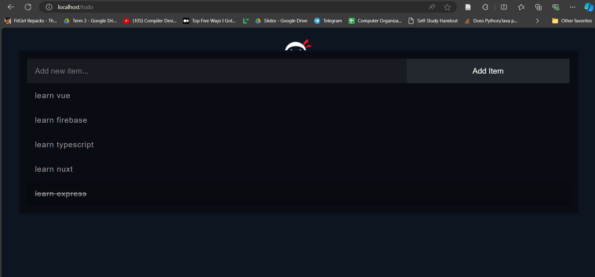

# Simple Todo App

This is a simple Todo application built using Node.js, Express, and MongoDB. The app provides three basic functionalities:
- Show the todo list
- Add to the todo list
- Delete from the todo list

## Features

1. **Show the Todo List:** Displays all the items in the todo list.
2. **Add to the Todo List:** Allows users to add a new item to the todo list.
3. **Delete from the List:** Allows users to delete an item from the todo list.

## Installation

1. **Clone the repository:**

    ```bash
    git clone https://github.com/AhmedHeshams/todo-app.git
    cd todo-app
    ```

2. **Install dependencies:**

    ```bash
    npm install
    ```

3. **Set up MongoDB:**

    Ensure you have MongoDB installed and running. Create a `.env` file in the root directory and add your MongoDB URI:

    ```bash
    MONGO_URI=mongodb://localhost:27017/todo-app
    ```

4. **Run the application:**

    ```bash
    npm start
    ```

    The application will be running on `http://localhost:80`.

## Usage

1. **View the Todo List:**
   - Navigate to `http://localhost:80` to see the list of todos.

2. **Add a Todo:**
   - Use the input field on the main page to add a new todo item.

3. **Delete a Todo:**
   - Click the item to remove it from the list.

## Project Structure

```
├── controllers
│   └── todocontroller.js
├── img
│   └── test.png
├── node_modules
    └── ..
    └── ..
    └── ..
    └── ..
├── public
│   └── assets
│       ├── logo.png
│       ├── styles.css
│       └── todo-list.js
├── views
│   └── to-do.ejs
├── .env
├── .gitignore
├── app.js
├── package-lock.json
├── package.json
└── README.md

```

## Screenshot




